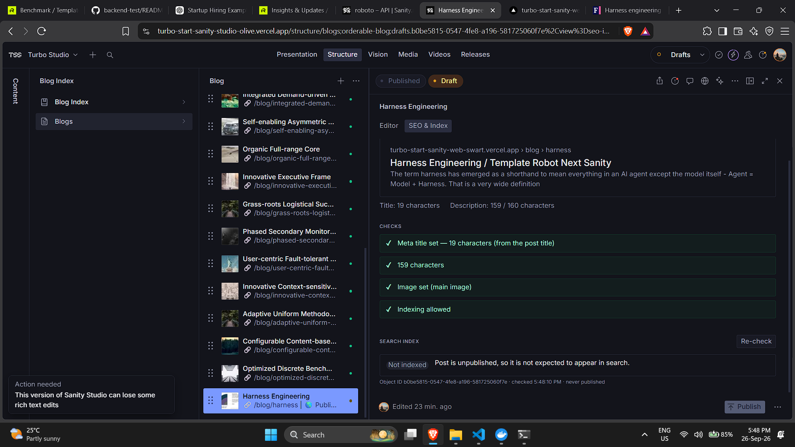
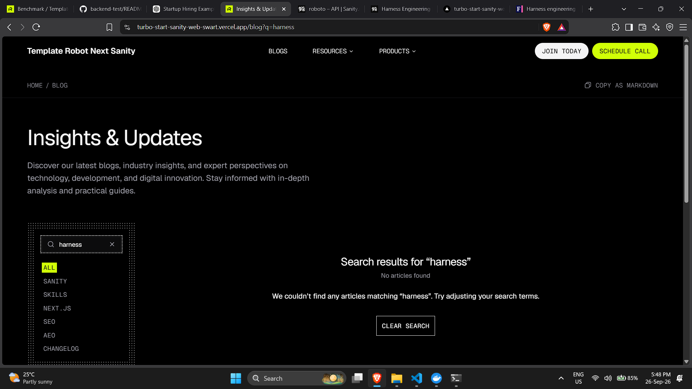
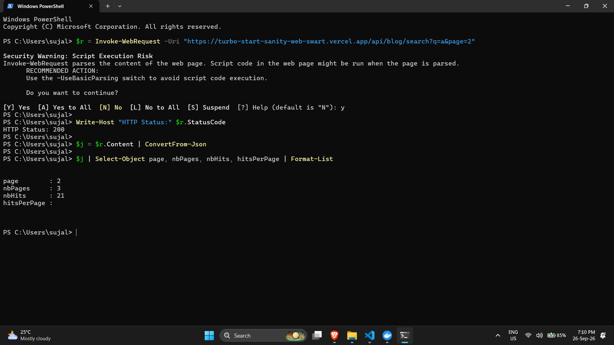
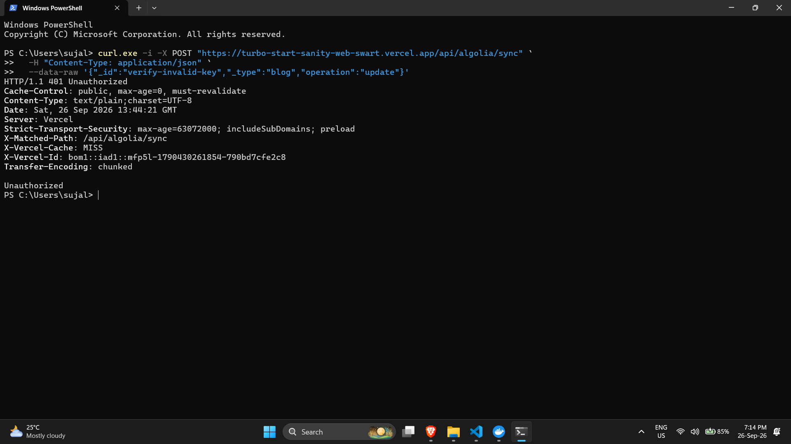

# Verification

Production site: https://turbo-start-sanity-web-swart.vercel.app
Deployed Studio: https://turbo-start-sanity-studio-olive.vercel.app
Sanity-hosted Studio (`npx sanity deploy`): https://turbo-start-sanity-sujal.sanity.studio
Sanity project: `tzzuuieg`, dataset `production`. Algolia index: `blog_posts`.

All output below is pasted from real runs against the deployed site on 2026-09-25 and
2026-09-26. Secrets are read from `apps/web/.env` by the scripts and never printed; they
appear as `$SECRET`, `$APP`, `$SEARCH_KEY` in the commands. Screenshots are the `image*.png`
files next to this document; the two recordings for items 7 and 8 are the `verify-*.mp4`
files (click the link, GitHub plays them inline).

## Webhook that exists

Created through Sanity's management API (the same endpoint sanity.io/manage → API → Webhooks
uses) and confirmed with the CLI:

```
$ npx sanity hook list
Name: algolia-sync
Dataset: production
URL: https://turbo-start-sanity-web-swart.vercel.app/api/algolia/sync
HTTP method: POST
Description: Keeps the Algolia blog index in step with published blog posts
```

Rule: `on: ["create","update","delete"]`, filter `_type == "blog"`,
projection `{_id, _type, "operation": delta::operation()}`, `includeDrafts: false`,
`includeAllVersions: false`, secret = `SANITY_WEBHOOK_SECRET`.

## Backfill and index settings (task 2b)

```
$ curl -X POST $SITE/api/algolia/backfill -H "authorization: Bearer $SECRET"
{"indexed":21,"settingsTaskID":null,"taskIDs":[27701620]} (200, 1.73s)
$ curl -X POST $SITE/api/algolia/backfill -H "authorization: Bearer $SECRET"      # second run
{"indexed":21,"settingsTaskID":null,"taskIDs":[27701650]} (200, 1.03s)
$ curl -X POST $SITE/api/algolia/backfill                                          # no key
401

$ curl "https://$APP-dsn.algolia.net/1/indexes/blog_posts/settings" -H "X-Algolia-Application-Id: $APP" -H "X-Algolia-API-Key: $SEARCH_KEY"
{
 "searchableAttributes": ["title", "description", "authorName"],
 "attributesForFaceting": ["filterOnly(category)"],
 "attributesToRetrieve": ["_type","_id","title","description","slug","orderRank","category","image","publishedAt","authors"],
 "hitsPerPage": 9
}
records: nbHits 21; sample objectID == _id: true
```

`settingsTaskID: null` on both runs means the live settings already matched the code and no
reindex was queued. Records are upserts keyed on the Sanity `_id`, so the count is 21 after
every run.

## 1. Publishing a post puts it in the index

Scripted run: a Sanity mutation with the write token, the real webhook delivering to the
production route, the record read back from Algolia with the search-only key (polling every 2 s).

```
--- 1 publish (create published doc) ---
PASS 1 publish -> in index: record {"title":"Webhook verification post","category":"seo"} after 4s
--- 2 edit searchable field ---
PASS 2 edit -> record updated: record {"title":"Webhook verification post (edited)","category":"seo"} after 4s
```

Manual run: a new post, "Harness engineering for coding agent users", published from Studio and
found by the site search straight after.


## 2. Unpublishing or deleting removes it

Scripted run (same harness as item 1):

```
--- 3 seoHideFromLists = true ---
PASS 3 hidden -> removed: record absent after 4s
--- 4 seoNoIndex = true ---
PASS 4 noindex -> removed: record absent after 4s
--- 5 unpublish (delete published id, keep a draft) ---
PASS 5 unpublish -> removed: record absent after 2s
--- 6 re-publish then delete ---
PASS 6a re-publish -> in index: record {"title":"Webhook verification post","category":"seo"} after 2s
PASS 6 delete -> removed: record absent after 4s
```

Sanity's own delivery log for these events:

```
$ npx sanity hook logs algolia-sync
Date: 2026-09-25T17:24:15.895Z   Status: success   Result code: 200
Date: 2026-09-25T17:24:11.887Z   Status: success   Result code: 200
Date: 2026-09-25T17:24:01.887Z   Status: success   Result code: 200
Date: 2026-09-25T17:23:55.886Z   Status: success   Result code: 200
Date: 2026-09-25T17:23:49.880Z   Status: success   Result code: 200
Date: 2026-09-25T17:23:43.858Z   Status: success   Result code: 200
Date: 2026-09-25T17:23:37.842Z   Status: success   Result code: 200
Date: 2026-09-25T17:23:31.822Z   Status: success   Result code: 200
Date: 2026-09-25T17:23:24.755Z   Status: success   Result code: 200
```

Manual run: the "Harness engineering" post from item 1 was unpublished in Studio. The search
API then returns no hits for its title, and the site search page shows no results.


## 3. A draft never appears in search results

Scripted run: after the unpublish in item 2 the draft `drafts.verify-webhook-post` still
existed in Sanity:

```
   draft still exists: true (drafts must never be indexed)
   draft indexed? no (correct)
```

A signed delivery naming a draft id is acknowledged and ignored by the route:

```
9b draft id, signed                            200 {"ignored":"draft"}
```

The backfill query and the re-fetch inside the route both use the published perspective, so
drafts cannot enter the index by either path.

Manual run: "Harness Engineering" exists only as a draft. The Studio tab reports it as not
indexed, and the site search does not find it.





## 4. The same webhook delivery twice leaves one entry, not two

Document `Enhanced 24 hour Structure`, object ID `05156083-2ff3-43c2-a449-86e0d445c91d`.
The exact same body, timestamp and signature were sent twice to the production
`/api/algolia/sync` route.

```
Body:   {"_id":"05156083-2ff3-43c2-a449-86e0d445c91d","_type":"blog","operation":"update"}
Header: sanity-webhook-signature: t=1790429200377,v1=<redacted>

Delivery 1: HTTP 200 {"objectID":"05156083-2ff3-43c2-a449-86e0d445c91d","action":"upsert","taskID":29966375}
Delivery 2: HTTP 200 {"objectID":"05156083-2ff3-43c2-a449-86e0d445c91d","action":"upsert","taskID":29966716}

$ curl "$SITE/api/blog/search?q=Enhanced%2024%20hour%20Structure"
nbHits: 1   page: 1   nbPages: 1
hits[0].objectID = hits[0]._id = 05156083-2ff3-43c2-a449-86e0d445c91d
```

Both deliveries upserted the same object ID; the second only produced a new Algolia task id.
Exactly one record carries that id.

Earlier scripted run of the same check, counting the whole index:

```
index records before: 21
7 delivery #1 (signed)                         200 {"objectID":"02b5ca06-…","action":"upsert","taskID":27706494}
7 delivery #2 (identical replay)               200 {"objectID":"02b5ca06-…","action":"upsert","taskID":27706495}
index records after two identical deliveries: 21 (must be unchanged)
```

## 5. `/api/blog/search` returns page 2

```
$ curl "$SITE/api/blog/search?q=Ramon"
200 {'nbHits': 12, 'page': 1, 'nbPages': 2} hits 9
$ curl "$SITE/api/blog/search?q=Ramon&page=2"
200 {'nbHits': 12, 'page': 2, 'nbPages': 2} hits 3
$ curl "$SITE/api/blog/search?q=Ramon&category=aeo"
200 {'nbHits': 2, 'page': 1, 'nbPages': 1} hits 2
$ curl "$SITE/api/blog/search?q=&page=1"          -> 400 {'error': 'Invalid search parameters'}
$ curl "$SITE/api/blog/search?q=x&page=0"         -> 400
$ curl "$SITE/api/blog/search?q=x&category=bogus" -> 400
```



Without JavaScript, the same URLs render on the server (counts from the served HTML;
`form` = the GET search form, `q-links` = category and page links that carry the query):

```
/blog?q=Ramon               form=2 header=1 q-links=8 noindex=2 count-text=['12']
/blog?q=Ramon&page=2        form=2 header=1 q-links=7 noindex=2 count-text=['12']
/blog?q=Ramon&category=aeo  form=2 header=1 q-links=7 noindex=2 count-text=['2']
```


## 6. A request with no valid key is rejected

```
8a no signature header                         401 Unauthorized
8b tampered signature                          401 Unauthorized
8c valid signature, tampered body              401 Unauthorized
8d stale timestamp (10 min old)                401 Unauthorized
$ curl -X POST $SITE/api/algolia/sync -d '{}'  -> 401
$ curl -X POST $SITE/api/algolia/backfill      -> 401
```



Unrelated document types do not crash the route:

```
9 unrelated type (author), signed              200 {"ignored":"type"}
```

## 7. The Studio tab updates while you type

Recording: [verify-7-studio-updates-while-typing.mp4](verify-7-studio-updates-while-typing.mp4)

The preview, character counts and checks read the live form value, so they move on every
keystroke before anything is saved or published.

## 8. The Studio tab correctly reports one post that is in the index and one that isn't

Recording: [verify-8-studio-index-status.mp4](verify-8-studio-index-status.mp4)

A published seed post shows "Indexed"; the unpublished draft shows "Not indexed" with the
reason. The lookup uses the published `_id` (the Algolia object ID) and the search-only key.

## 9. PageSpeed (bonus)

Not attempted.
