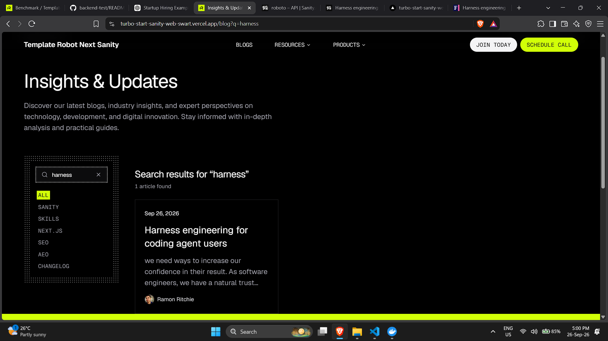
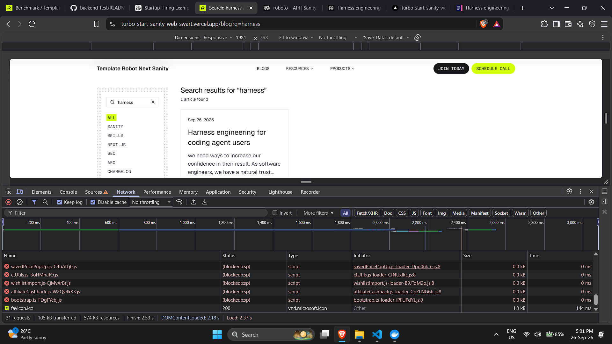
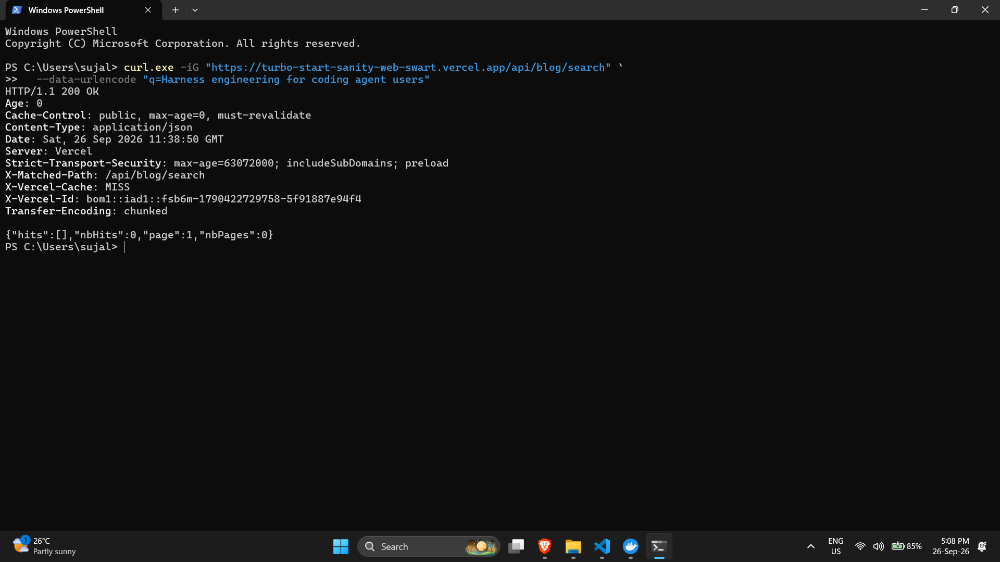
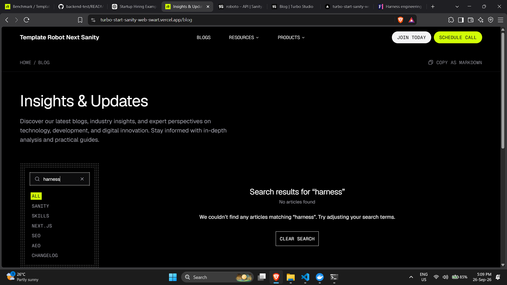

# Verification

Production site: https://turbo-start-sanity-web-swart.vercel.app
Sanity project: `tzzuuieg`, dataset `production`. Algolia index: `blog_posts`.

All output below is pasted from real runs against the deployed site on 2026-09-25.
Secrets are read from `apps/web/.env` by the scripts and never printed; they appear as
`$SECRET`, `$APP`, `$SEARCH_KEY` in the commands.

## Webhook that exists

Created through Sanity's management API (the same endpoint sanity.io/manage → API → Webhooks uses) and confirmed with the CLI:

```
$ npx sanity hook list
Name: algolia-sync
Dataset: production
URL: https://turbo-start-sanity-web-swart.vercel.app/api/algolia/sync
HTTP method: POST
Description: Keeps the Algolia blog index in step with published blog posts
```

Rule: `on: ["create","update","delete"]`, filter `_type == "blog"`,
projection `{_id, _type, "operation": delta::operation()}`, `includeDrafts: false`,
`includeAllVersions: false`, secret = `SANITY_WEBHOOK_SECRET`.

## Backfill and index settings (task 2b)

```
$ curl -X POST $SITE/api/algolia/backfill -H "authorization: Bearer $SECRET"
{"indexed":21,"settingsTaskID":null,"taskIDs":[27701620]} (200, 1.73s)
$ curl -X POST $SITE/api/algolia/backfill -H "authorization: Bearer $SECRET"      # second run
{"indexed":21,"settingsTaskID":null,"taskIDs":[27701650]} (200, 1.03s)
$ curl -X POST $SITE/api/algolia/backfill                                          # no key
401

$ curl "https://$APP-dsn.algolia.net/1/indexes/blog_posts/settings" -H "X-Algolia-Application-Id: $APP" -H "X-Algolia-API-Key: $SEARCH_KEY"
{
 "searchableAttributes": ["title", "description", "authorName"],
 "attributesForFaceting": ["filterOnly(category)"],
 "attributesToRetrieve": ["_type","_id","title","description","slug","orderRank","category","image","publishedAt","authors"],
 "hitsPerPage": 9
}
records: nbHits 21; sample objectID == _id: true
```

`settingsTaskID: null` on both runs means the live settings already matched the code and no reindex was queued. Records are upserts keyed on the Sanity `_id`, so the count is 21 after every run.

## 1. Publishing a post puts it in the index

Driven by a Sanity mutation with the write token; the real webhook delivered to the production route; the record was read back from Algolia with the search-only key (polling every 2 s).

```
--- 1 publish (create published doc) ---
PASS 1 publish -> in index: record {"title":"Webhook verification post","category":"seo"} after 4s
--- 2 edit searchable field ---
PASS 2 edit -> record updated: record {"title":"Webhook verification post (edited)","category":"seo"} after 4s
```
 
## 2. Unpublishing or deleting removes it


```
--- 3 seoHideFromLists = true ---
PASS 3 hidden -> removed: record absent after 4s
--- 4 seoNoIndex = true ---
PASS 4 noindex -> removed: record absent after 4s
--- 5 unpublish (delete published id, keep a draft) ---
PASS 5 unpublish -> removed: record absent after 2s
--- 6 re-publish then delete ---
PASS 6a re-publish -> in index: record {"title":"Webhook verification post","category":"seo"} after 2s
PASS 6 delete -> removed: record absent after 4s
```

Sanity's own delivery log for these events:

```
$ npx sanity hook logs algolia-sync
Date: 2026-09-25T17:24:15.895Z   Status: success   Result code: 200
Date: 2026-09-25T17:24:11.887Z   Status: success   Result code: 200
Date: 2026-09-25T17:24:01.887Z   Status: success   Result code: 200
Date: 2026-09-25T17:23:55.886Z   Status: success   Result code: 200
Date: 2026-09-25T17:23:49.880Z   Status: success   Result code: 200
Date: 2026-09-25T17:23:43.858Z   Status: success   Result code: 200
Date: 2026-09-25T17:23:37.842Z   Status: success   Result code: 200
Date: 2026-09-25T17:23:31.822Z   Status: success   Result code: 200
Date: 2026-09-25T17:23:24.755Z   Status: success   Result code: 200
```

## 3. A draft never appears in search results

After the unpublish in step 5 the draft `drafts.verify-webhook-post` still existed in Sanity:

```
   draft still exists: true (drafts must never be indexed)
   draft indexed? no (correct)
```

A signed delivery naming a draft id is acknowledged and ignored by the route:

```
9b draft id, signed                            200 {"ignored":"draft"}
```

The backfill query and the re-fetch inside the route both use the published perspective, so drafts cannot enter the index by either path.

## 4. The same delivery twice leaves one entry

Two byte-identical, identically signed deliveries for a published post:

```
index records before: 21
7 delivery #1 (signed)                         200 {"objectID":"02b5ca06-f5dc-49f3-b6f7-8b941f3bf739","action":"upsert","taskID":27706494}
7 delivery #2 (identical replay)               200 {"objectID":"02b5ca06-f5dc-49f3-b6f7-8b941f3bf739","action":"upsert","taskID":27706495}
index records after two identical deliveries: 21 (must be unchanged)
```

## 5. `/api/blog/search` returns page 2

```
$ curl "$SITE/api/blog/search?q=Ramon"
200 {'nbHits': 12, 'page': 1, 'nbPages': 2} hits 9
$ curl "$SITE/api/blog/search?q=Ramon&page=2"
200 {'nbHits': 12, 'page': 2, 'nbPages': 2} hits 3
$ curl "$SITE/api/blog/search?q=Ramon&category=aeo"
200 {'nbHits': 2, 'page': 1, 'nbPages': 1} hits 2
$ curl "$SITE/api/blog/search?q=&page=1"          -> 400 {'error': 'Invalid search parameters'}
$ curl "$SITE/api/blog/search?q=x&page=0"         -> 400
$ curl "$SITE/api/blog/search?q=x&category=bogus" -> 400
```

Without JavaScript, the same URLs render on the server (counts from the served HTML;
`form` = the GET search form, `q-links` = category and page links that carry the query):

```
/blog?q=Ramon               form=2 header=1 q-links=8 noindex=2 count-text=['12']
/blog?q=Ramon&page=2        form=2 header=1 q-links=7 noindex=2 count-text=['12']
/blog?q=Ramon&category=aeo  form=2 header=1 q-links=7 noindex=2 count-text=['2']
```

## 6. A request with no valid key is rejected

```
8a no signature header                         401 Unauthorized
8b tampered signature                          401 Unauthorized
8c valid signature, tampered body              401 Unauthorized
8d stale timestamp (10 min old)                401 Unauthorized
$ curl -X POST $SITE/api/algolia/sync -d '{}'  -> 401
$ curl -X POST $SITE/api/algolia/backfill      -> 401
```

Unrelated document types do not crash the route:

```
9 unrelated type (author), signed              200 {"ignored":"type"}
```

## 7. Studio tab updates while typing

_Recording to be added (task 3)._

## 8. Studio tab reports one post in the index and one not

_Recording to be added (task 3)._

## 9. PageSpeed (bonus)

_Not attempted yet._
